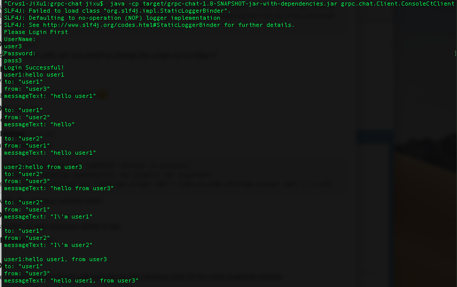
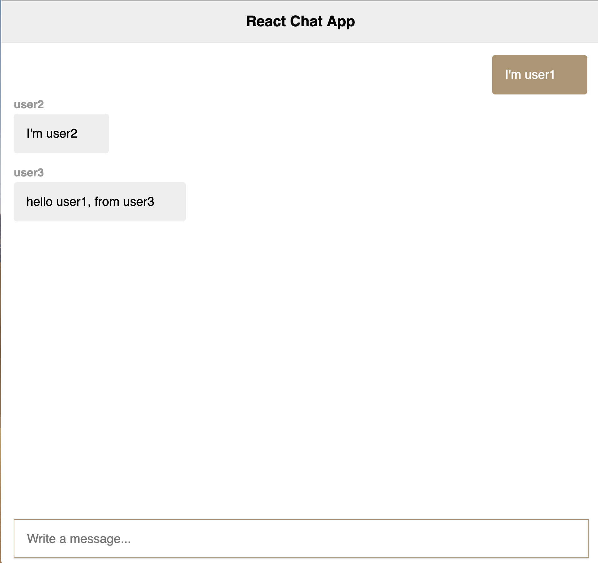
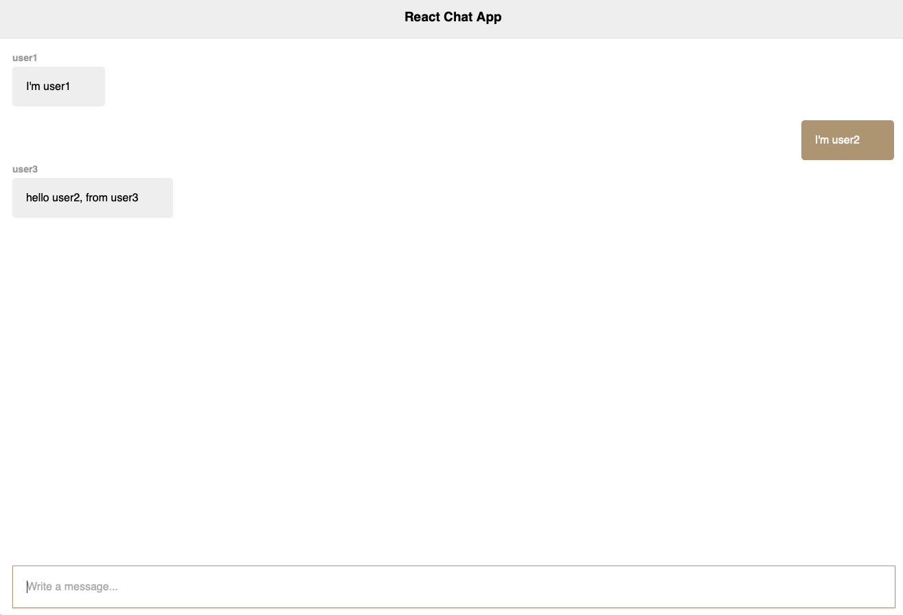

# Reactive gRPC Chat Application
A simple IRC-like chat application with [gRPC web](https://github.com/grpc/grpc-web).
* The client is bootstrapped with [Create React App](https://github.com/facebook/create-react-app).
* The grpc chat server is implemented in Java

## Prerequisites
From the repo root directory:
```sh
$ docker-compose up -d
```

### Generate Protobuf Messages and Client Service Stub
For generating client-side code in javascript, run the following command:
```sh
$ protoc -I=. chat.proto \
  --js_out=import_style=commonjs:. \
  --grpc-web_out=import_style=commonjs,mode=grpcwebtext:.
```
You'll most likely run into this compilation issue says "`proto` is not defined". 
There is apparently an issue when using gRPC-web with a project created using create-react-app command line interface. 
This issue can be fixed by adding eslint-disable to all of the proto generated files. Make sure that you do this for all the generated files. 

## Run Client
In the learn-react-grpc project directory, run the following commands:
```sh
$ npm install
$ npm start
```

It will run the app in the development mode.<br>
Open [http://localhost:3000](http://localhost:3000) to view it in the browser.

The page will reload if you make edits.<br>

## Run Server
Navigate to the server/grpc-chat project directory, you can then build and run the grpc-chat server.
```sh
$ mvn clean compile assembly:single
$ java -cp  target/grpc-chat-1.0-SNAPSHOT-jar-with-dependencies.jar grpc.chat.Server.ChatServer
```

## Screenshots



